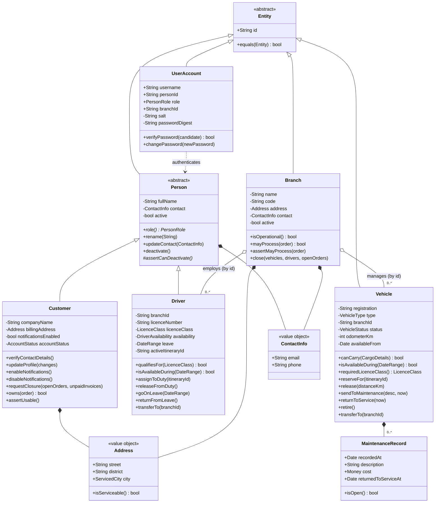
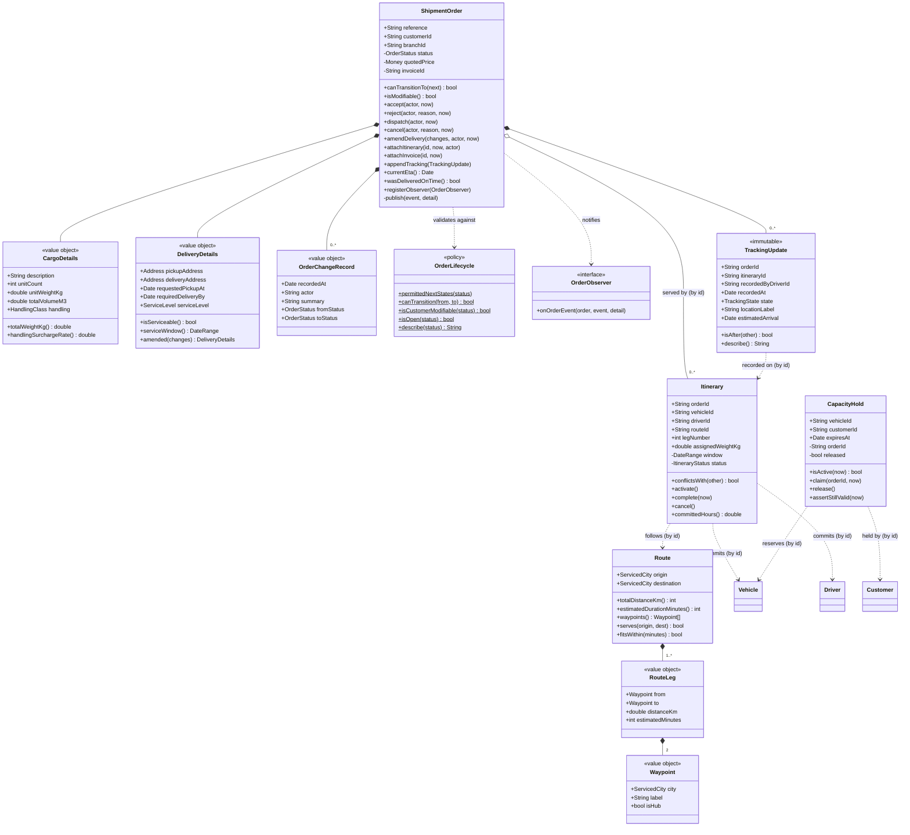
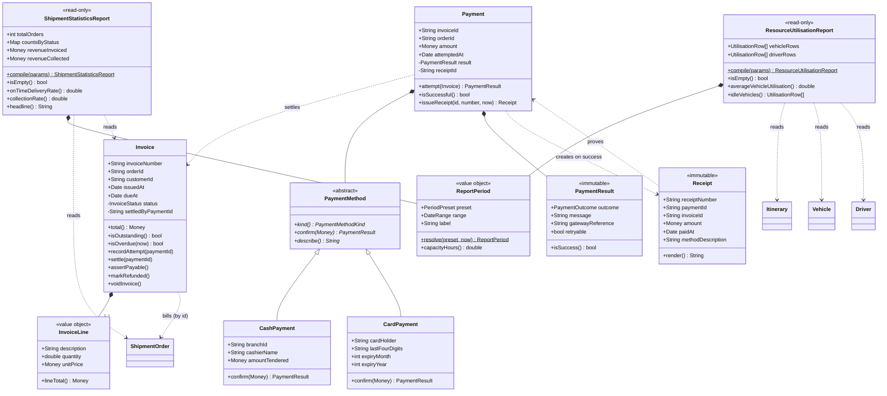
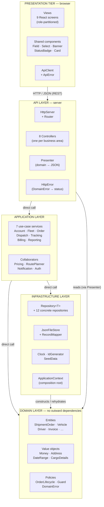

# SmartFM — Detailed Design, Implementation and Reflection

**SWE30003 Software Architectures and Design — Assignment 3**
**Group 1 — Smart Fleet Management (SmartFM) for ABC-Trans**

> This document is organised to follow the Assignment 3 marking sheet section by section.
> Assignment 2 is attached as an appendix and is the basis for every comparison made here.

| Marking sheet section | Where |
| --- | --- |
| (I) Detailed design, with justification of changes and non-changes — 30 | [§1](#1-detailed-object-oriented-design) |
| (II) Discussion of the Assignment 2 design — 20 | [§2](#2-discussion-of-the-assignment-2-design) |
| (III) Lessons learnt — 10 | [§3](#3-lessons-learnt) |
| (IV) Architecture style(s) — 10 | [§4](#4-architecture-styles) |
| (V) Implementation: source code and coding standard — 20 | [§5](#5-implementation) |
| (VI) Compilation and execution evidence — 30 | [§6](#6-compilation-and-execution) |

---

## 0. Executive summary

ABC-Trans is a Vietnamese logistics company whose order intake, vehicle and driver assignment,
shipment tracking, payment and reporting are handled manually or through disconnected branch
systems. The result is slow service, vehicles that sit idle while customers wait, and management
reports that arrive late and disagree with each other.

SmartFM is the centralised replacement. A customer searches real availability across every branch,
holds a vehicle while they decide, and places an order; the owning branch verifies and accepts it,
binds a legally-qualified driver and a suitable vehicle to a planned route, and dispatches it; the
driver reports checkpoints from the road; the customer watches the timeline and settles an itemised
invoice; and management reads shipment and utilisation figures compiled from the same records.

This assignment took the high-level object design from Assignment 2 and carried it through to a
working system: **17,500 lines of TypeScript across 95 files**, covering **all seven** business areas
(the specification requires four), verified by **118 automated tests** and demonstrable end-to-end
through a browser interface. Nineteen design changes and ten deliberate non-changes are recorded and
justified below.

---

## 1. Detailed object-oriented design

### 1.1 Final class diagram

The design has four layers. Only the **domain layer** is shown in the class diagrams; the
application, infrastructure and presentation layers are covered in §4.

#### Figure 1 — People, fleet and access



**Reading note.** `Branch → Vehicle` and `Branch → Driver` are **aggregations** (open diamond), not
compositions. This is change **C3**, and the reason is visible in the diagram itself:
`Vehicle.transferTo()` and `Driver.transferTo()` exist, so a resource's lifetime is not bounded by
any one branch. `Branch` holds no collections at all; the association is realised by the resource
holding a `branchId` and the repository answering `findByBranch()`.

#### Figure 2 — Ordering, dispatch and tracking



**Reading note.** Three relationships changed from Assignment 2 and are the corrections the marker
asked for:

- `ShipmentOrder → Itinerary` is now **aggregation** (**C5**). An itinerary commits resources the
  branch owns and must survive the order for utilisation reporting.
- `ShipmentOrder → Route` is **gone entirely** (**C4**). A route is a reusable *lane*; several orders
  share one, and the route is reached through the itinerary.
- `Route` now has internal structure — `RouteLeg` and `Waypoint` (**C6**) — which is what the marker
  meant by "Route, Itinerary: missing additional associated classes".

Composition is *retained* for `CargoDetails`, `DeliveryDetails`, `TrackingUpdate` and
`OrderChangeRecord`, because none of those has meaning once its order is gone (**N2**).

#### Figure 3 — Billing and reporting



**Reading note.** The Strategy pattern around `PaymentMethod` is unchanged from Assignment 2
(**N6**) — the one design decision implementation vindicated without qualification. The generic
`Report` the marker called "too generic" has become two focused, immutable report classes plus a
`ReportPeriod` value object (**C2**).

### 1.2 Changes at class level, with justification

Nineteen changes were made. Each states what the initial design said, why implementation could not
proceed with it, and what replaced it.

| # | Change | Why the Assignment 2 design could not be implemented as drawn | Justification |
| --- | --- | --- | --- |
| **C1** | **`SmartFMSystem` removed.** Replaced by seven application services (`AccountService`, `FleetService`, `OrderService`, `DispatchService`, `TrackingService`, `BillingService`, `ReportingService`) plus `ApplicationContext` as the composition root. | The marker's note was "SmartFMSystem: not a domain class (not needed at this stage)". Implementation confirmed it: one class asked to initialise the object graph *and* coordinate every cross-aggregate use case has seven unrelated reasons to change, which is a god class by construction. | Splitting by business area gives each service a single reason to change and lets each depend only on the repositories its own use cases touch. Construction is a separate concern and moved to infrastructure. |
| **C2** | **`Report` split** into `ShipmentStatisticsReport`, `ResourceUtilisationReport` and `ReportPeriod`. | The marker's note was "Report: too generic". One class was expected to compile shipment statistics, calculate utilisation, handle empty periods and stay read-only. Nothing about its interface said what it produced. | Each report now has one key abstraction and one reason to change. The arithmetic lives in the report objects, so it is unit-testable from plain domain objects with no storage — see `domain.test.ts`. |
| **C3** | **`(Branch, Vehicle)` and `(Branch, Driver)`: composition → aggregation.** `Branch` holds no collections; resources hold a `branchId`. | The marker rejected the composition. Two facts make it wrong: a resource can be *transferred* between branches, and closing a branch must preserve its resources for redeployment. | `Vehicle.transferTo()` and `Driver.transferTo()` are the concrete evidence. `Branch.close()` now *refuses* until the resources have been moved, which is only meaningful if the branch does not own them. |
| **C4** | **`(ShipmentOrder, Route)`: composition removed entirely.** `Route` became an independent, reusable object owned by `RoutePlanner` and stored in its own collection. | The marker rejected the composition. A route is a lane between two cities — Ho Chi Minh to Da Nang is the same path whoever ships along it. Under composition, every order would have stored a private duplicate. | Routes are now cached by lane and shared. `ShipmentOrder` holds no route reference at all; the route is reached through the itinerary that schedules it. |
| **C5** | **`(ShipmentOrder, Itinerary)`: composition → aggregation.** | The marker rejected the composition. An itinerary binds a *vehicle* and a *driver* — resources the branch owns — and `ResourceUtilisationReport` must still read completed itineraries months after the order closes. | The order records `itineraryIds`; itineraries live in their own collection. This is precisely what makes utilisation reporting possible, as the test "a completed itinerary still records the hours it consumed" shows. |
| **C6** | **Associated classes added:** `Waypoint`, `RouteLeg` (for `Route`); `ItineraryStatus` and a scheduled `DateRange` (for `Itinerary`); `MaintenanceRecord`, `OrderChangeRecord`, `InvoiceLine`. | The marker's note was "Route, Itinerary: missing additional associated classes". Beyond that, Assignment 1 required a vehicle maintenance history (Task 1), an order change history (Task 6) and an itemised invoice (Tasks 5 and 9) — none of which had a class to live in. | A route is now composed of legs over waypoints, so its distance and duration are *derived* and can never contradict its path. The other three classes turn three requirements from unimplementable into implemented. |
| **C7** | **Bundled CRC responsibilities split** into fine-grained methods, each with its own collaborators. | The marker's note was that "bundled responsibilities should be listed as separate ones … ⇒ different collaborators". `Customer`'s row "maintain account identity, contact details, authentication state and notification preference" is four responsibilities with four different collaborators. | See §1.3 for the full before/after. Each method now has one job, and its collaborators correspond to associations that actually exist in the class diagram. |
| **C8** | **`Person` removed as a collaborator.** `ContactInfo` introduced as the real one. | The marker flagged "Customer: Person" as an incorrect collaborator. A superclass is not a collaborator — inheritance is not collaboration. | `ContactInfo` is the object `Customer`, `Driver` and `Branch` genuinely collaborate with to hold and validate contact facts. |
| **C9** | **Presentation tier added:** `Presenter` (server-side projection), `ApiClient`, 9 React views, shared `Field`/`Select`/`Banner`/`StatusBadge` components. | Assignment 2 explicitly excluded user-interface design. Assignment 3 requires it. | Presenting explicitly keeps the boundary one-way: the domain never learns that a browser exists, private state cannot leak onto the wire, and each view receives exactly the fields it renders. |
| **C10** | **Persistence tier added:** `Repository<T>` (abstract generic), 12 concrete repositories, `JsonFileStore`, `RecordMapper`, plus injected `Clock` and `IdGenerator`. | Assignment 2's assumption A12 excluded persistence. That was reasonable for a high-level design but left the single largest gap to close. | Repository was chosen over active-record so that no domain class imports `node:fs`. Object↔record mapping is explicit and reviewable, one method pair per aggregate. `Clock` is injected because every rule in SmartFM is time-sensitive and a hard-coded `new Date()` would make "the hold expired" untestable without waiting fifteen real minutes. |
| **C11** | **Value objects added:** `Money`, `Address`, `ContactInfo`, `DateRange`, plus `Entity` as the identity root. | Assignment 2 passed prices, addresses and periods as bare primitives. Assignment 1 Task 7 variant 3c ("delivery address cannot be verified") is unimplementable when an address is free text. | `Address.isServiceable()` gives that variant a concrete meaning. `Money` stores whole dong so invoice totals, payment amounts and report revenue cannot drift apart through floating-point rounding. `DateRange.overlaps()` is why `Itinerary.conflictsWith()` is two lines. |
| **C12** | **`UserAccount` and `AuthService` added.** | Assignment 1 identified three actors with sharply different permissions; Assignment 2 modelled no notion of "who is asking". "A customer sees only their own orders" (Task 8 variant 1a) cannot be enforced without it. | Credentials are a security-tier concern, so they sit on a separate class rather than on `Customer` — one key abstraction per class. |
| **C13** | **`PricingService` added.** | Assignment 2's Scenario 1 had `Branch` offering vehicles "with price information" and the customer reviewing "the total cost", but no class owned pricing. An implementer had to guess between `Branch`, `ShipmentOrder`, `Route` and `Invoice`. | A tariff is a *policy* that changes for commercial reasons, independently of all four. `quote()` returns `InvoiceLine[]`, so the quote a customer agrees and the invoice they are billed are produced by the same call and can never disagree. |
| **C14** | **`CapacityHold` added.** | Assignment 2's Scenario 1 step 5 required an "atomic temporary hold" and assumption A13 insisted it was distinct from the itinerary — but no class owned it. | Making it first-class is what turns Assignment 1 Task 4 variant 5a (the concurrent-booking race) from prose into demonstrable behaviour. Implementation also corrected a detail: the hold is taken by a **customer**, not an order, because it exists precisely *before* an order is submitted. It is later *claimed* by the resulting order or released. |
| **C15** | **`OrderLifecycle` transition table published.** | Assignment 2 said `ShipmentOrder` "controls permitted lifecycle transitions" without saying what they were. This was the single clearest case where the initial design forced interpretation. | The table is now data, reviewable and testable. `ShipmentOrder.transitionTo()` is the only path that changes status, so the table cannot be bypassed. `permittedNextStates()` is also sent to the browser, so the interface can never offer an action the domain would refuse. |
| **C16** | **`PaymentResult` value object added.** | Assignment 2 said the strategy should "return a confirmed or failed result" without describing it. | A boolean cannot tell the customer *why* an attempt failed or whether retrying is worthwhile — which Assignment 1 Task 9 variant 3a requires. `retryable` drives the message the customer actually sees. |
| **C17** | **`OrderObserver` interface added; `NotificationService` implements it.** | Assignment 2 §5.2 claimed the Observer pattern with `ShipmentOrder` as subject and `Customer` as observer, but no observer abstraction appeared in the diagram or the CRC cards — the pattern existed only in prose. | `Customer` is deliberately **not** the observer: a customer is a domain fact, not a delivery channel, and making it the observer would drag email/SMS concerns into the domain. `publish()` fires only after the state change is committed and swallows observer failures, because notification must never roll back a shipment event. |
| **C18** | **`DomainError` hierarchy and `Guard` added.** | Assignment 2 described alternate and error paths in prose. An implementation needs a way for a domain object to refuse an operation without knowing about HTTP, the UI or storage. | `HttpError` is the *only* class in the system that knows status codes. `Guard.collect()` reports every invalid field at once, which Assignment 1's usability attribute (complete an order unaided in under three minutes) makes necessary. |
| **C19** | **`ShipmentOrder.appendTracking()` given ownership and ordering guards; `DISPATCHED → DELIVERED` added to the lifecycle.** | Found during implementation: a same-city express run can be delivered before the driver has cause to post an in-transit checkpoint, which the original table forbade. | A small correction, but it illustrates the general point — the transition table only became falsifiable once it was written down. |

### 1.3 Changes to responsibilities and collaborators

The marker's criticism of the Assignment 2 CRC cards was specific: responsibilities were bundled,
collaborators were listed per-class rather than per-responsibility, and several collaborators did not
correspond to any association in the class diagram. Every one of those is addressed.

#### Worked example — `Customer`

| Assignment 2 responsibility (bundled) | Listed collaborators | Assignment 3 responsibilities (split) | Collaborators, each an association that exists |
| --- | --- | --- | --- |
| "Maintain account identity, contact details, authentication state and notification preference" | Person, SmartFMSystem | `updateProfile(changes)` | `ContactInfo`, `Address` |
| | | `enableNotifications()` / `disableNotifications()` | — (own state) |
| | | `verifyContactDetails()` | — (own state) |
| | | *authentication state moved out entirely* | → `UserAccount` (**C12**) |
| "Request account recovery or safe deactivation; closure is blocked while active or unpaid orders exist" | SmartFMSystem, ShipmentOrder, Invoice | `requestClosure(openOrderCount, unpaidInvoiceCount)` | — (the caller supplies the counts; the *rule* stays here) |
| "Supply cargo and delivery requirements and submit an order request" | SmartFMSystem, ShipmentOrder, CargoDetails, DeliveryDetails | *moved to* `OrderService.placeOrder()` | Submitting an order is a use case, not something a customer object does |
| "View only the customer's own orders and tracking history" | ShipmentOrder, TrackingUpdate | `owns(order)` and `ShipmentOrder.assertOwnedBy()` | `ShipmentOrder` |
| "Choose a payment approach and settle an outstanding order" | ShipmentOrder, Payment, PaymentMethod | *moved to* `BillingService.payInvoice()` | A customer does not settle an invoice; a `Payment` does |
| "Receive shipment-state notifications, invoices and receipts" | ShipmentOrder, Invoice, Receipt | *moved to* `NotificationService` (**C17**) | Delivery is not a domain responsibility |

Three general corrections follow from this example and were applied to every class:

1. **`SmartFMSystem` disappears from every collaborator list** (**C1**). It appeared on eleven of the
   nineteen Assignment 2 cards, which was itself the evidence that it was a god class.
2. **`Person` disappears as a collaborator** (**C8**). Inheritance is not collaboration.
3. **Coordination responsibilities moved to services.** Assignment 2 gave `Branch` the responsibility
   to "find resources across branches matching cargo, timing, route and operational constraints". A
   branch cannot see other branches' fleets — that responsibility was misplaced, and it now sits in
   `FleetService`/`DispatchService` where the repositories make the query possible.

#### What deliberately stayed on domain objects

Moving coordination out risks producing an anaemic model, so the split was applied with a consistent
test: **a rule belongs on the object that holds the facts the rule needs.**

| Rule | Lives on | Why not the service |
| --- | --- | --- |
| Can this vehicle take this load? | `Vehicle.canCarry()` | The vehicle owns its capacity facts |
| May this vehicle be retired? | `Vehicle.retire()` | The vehicle knows whether it is committed |
| Does this driver's licence cover this vehicle? | `Driver.qualifiesFor()` | The driver owns their qualifications |
| Is this status transition permitted? | `ShipmentOrder.transitionTo()` + `OrderLifecycle` | The order owns its lifecycle |
| May this tracking update be appended? | `ShipmentOrder.appendTracking()` | The order owns its history |
| Has this invoice already been paid? | `Invoice.assertPayable()` | The invoice owns its settlement state |
| Do these two itineraries clash? | `Itinerary.conflictsWith()` | Only the itinerary knows both the resources and the window |
| Is this reservation still valid? | `CapacityHold.assertStillValid()` | The hold owns its own expiry |

The services fetch, coordinate and persist. They contain no `if` about domain state that a domain
object could have answered.

### 1.4 Changes to the dynamic aspects

#### Bootstrap process

Assignment 2's bootstrap scored 2.5/5 — the weakest part of that submission. It nominated
`SmartFMSystem` as both "the application controller" and "the bootstrap root", and gave a five-step
table that did not say where initialisation data came from or how identity was assigned.

Both halves of that job are now handled separately: **coordination** went to the seven services
(**C1**), and **construction** lives in `ApplicationContext`, an infrastructure object with no
business methods at all. The sequence is strict and acyclic:

```mermaid
sequenceDiagram
    autonumber
    participant Runtime as Execution environment
    participant Ctx as ApplicationContext
    participant Store as JsonFileStore
    participant Repos as 12 Repositories
    participant Seed as SeedData
    participant Ids as SequentialIdGenerator
    participant Svc as 7 Services + 4 collaborators
    participant Http as HttpServer

    Runtime->>Ctx: create(dataDirectory, clock)
    Note over Ctx: Step 1 — infrastructure with no dependencies
    Ctx->>Ctx: new SystemClock(), new SequentialIdGenerator()
    Ctx->>Store: new JsonFileStore(dir); initialise()
    Note over Ctx,Repos: Step 2 — repositories, each needing only the store
    Ctx->>Repos: new BranchRepository(store) … new ReceiptRepository(store)
    Note over Ctx,Seed: Step 3 — reference data, only when starting from nothing
    Ctx->>Store: isEmpty('branches')?
    alt first run
        Ctx->>Seed: install(repositories, clock)
        Seed->>Repos: 3 branches, 9 vehicles, 6 drivers, 2 customers, 11 accounts
    end
    Note over Ctx,Ids: Step 4 — never reissue a stored identity
    Ctx->>Repos: allIds() for every collection
    Ctx->>Ids: observeExisting(prefix, id) / observeExistingReference(...)
    Note over Ctx,Svc: Step 5 — stateless collaborators
    Ctx->>Svc: PricingService, RoutePlanner, NotificationService
    Note over Ctx,Svc: Step 6 — auth, then business services in dependency order
    Ctx->>Svc: AuthService → AccountService, FleetService, OrderService
    Ctx->>Svc: BillingService → DispatchService (dispatch invoices on completion)
    Ctx->>Svc: TrackingService, ReportingService
    Ctx-->>Runtime: ApplicationContext (fully wired)
    Runtime->>Http: new HttpServer(context, staticRoot); listen(4000)
    Http->>Http: register 8 controllers → 57 endpoints
```

Three things the initial design could not state are now explicit:

- **Where initialisation data comes from.** `SeedData` installs reference data only when the store is
  empty; orders, itineraries, invoices, payments and receipts are *never* seeded, so nothing in the
  demonstration is pre-baked.
- **Where identity comes from** (**C10**). Step 4 reads back every stored identity and advances the
  generator past it, so a restart cannot reissue an identifier a persisted object already holds. The
  test "a restart reuses stored data and does not reissue identities" proves it.
- **That there is no cycle.** `BillingService` is constructed before `DispatchService` because
  dispatch issues an invoice on completion. No service depends on one built after it.

`create()` is the only way to obtain a context, so a partially initialised application cannot exist.

#### Interaction scenarios

Assignment 2's four scenarios were re-run against the implementation. Two survived unchanged, two
needed correction, and four more were added for the business areas Assignment 3 also covers. All are
automated in `server/test/scenarios.test.ts`.

| A2 scenario | Outcome | Change required |
| --- | --- | --- |
| 1 — Place a shipment order | **Changed** | The hold is taken by the *customer*, not the order (**C14**), because it exists before the order does. Assignment 2 step 5 had the order taking a hold on itself, which is circular. A step was also added: the route is planned *before* the search, because route duration decides whether the customer's window is even feasible. |
| 2 — Process and dispatch | **Changed** | Route and itinerary creation moved from `Branch` to `DispatchService` (**C1**, **C4**). Assignment 2's postcondition promised that "partial itineraries are rolled back" but no mechanism existed; `validateAssignments()` now checks every pairing before *anything* is written, so a rejected assignment leaves nothing behind. |
| 3 — Track and notify | **Unchanged in substance** | The sequence held up exactly. The only refinement is that the observer is `NotificationService`, not `Customer` (**C17**). |
| 4 — Pay an invoice | **Unchanged in substance** | Invoice authorises → `Payment` delegates to the strategy → only success settles and creates a receipt. This is the part of Assignment 2 that needed no correction at all. |
| *(new)* 5 — Fleet and driver management | Added | Business area 2 |
| *(new)* 6 — Amend and cancel an order | Added | Business area 3, Assignment 1 Task 6 |
| *(new)* 7 — Management reporting | Added | Business area 7, Assignment 1 Task 10 |
| *(new)* 8 — Customer account management | Added | Business area 1, Assignment 1 Task 3 |

Two further syntactic points from the Assignment 2 feedback are addressed in the diagrams above:
actors are shown as participants with explicit roles, and alternate/error paths appear in the
diagrams rather than only in prose (see the `alt` block in the bootstrap diagram and the scenario
diagram below).

#### Figure 4 — Scenario 2 as implemented, including the error paths

```mermaid
sequenceDiagram
    autonumber
    actor Staff as Branch staff
    participant Ctrl as DispatchController
    participant Svc as DispatchService
    participant Br as Branch
    participant Ord as ShipmentOrder
    participant Plan as RoutePlanner
    participant Itn as Itinerary
    participant Veh as Vehicle
    participant Drv as Driver
    participant Bill as BillingService

    Staff->>Ctrl: GET /branch/orders/:id/review
    Ctrl->>Svc: reviewOrder(branchId, orderId)
    Svc->>Br: assertMayProcess(order)
    alt order belongs to another branch
        Br-->>Staff: RuleViolation "belongs to another branch"
    end
    Svc->>Plan: planRoute(pickupCity, deliveryCity)
    Plan-->>Svc: Route (cached by lane)
    Svc-->>Staff: problems[] + warnings[] + canAccept

    Staff->>Ctrl: POST /accept
    Ctrl->>Svc: acceptOrder(...)
    Svc->>Ord: accept(staffName, now)
    Ord->>Ord: transitionTo(ACCEPTED) via OrderLifecycle
    Ord-->>Staff: notify customer (Observer)

    Staff->>Ctrl: POST /assign {vehicleId, driverId}
    Ctrl->>Svc: assignResources(...)
    Note over Svc: validate ALL pairings before writing anything
    Svc->>Drv: qualifiesFor(vehicle.requiredLicenceClass())
    alt licence class insufficient
        Drv-->>Staff: RuleViolation — nothing written
    end
    Svc->>Itn: new Itinerary(...); conflictsWith(live)
    alt vehicle or driver already committed
        Itn-->>Staff: Conflict — nothing written
    end
    Svc->>Veh: reserveFor(itineraryId)
    Svc->>Drv: assignToDuty(itineraryId)
    Svc->>Ord: attachItinerary(id)

    Staff->>Ctrl: POST /dispatch
    Ctrl->>Svc: dispatchOrder(...)
    Svc->>Ord: dispatch(staffName, now)
    alt no itinerary assigned
        Ord-->>Staff: RuleViolation "no vehicle or driver assigned"
    end
    Svc->>Itn: activate()
    Svc->>Bill: issueInvoiceFor(order)
    Bill-->>Staff: Invoice (itemised, equals the agreed quote)
```

### 1.5 Non-changes, with justification

Ten Assignment 2 decisions were re-examined and deliberately kept. Recording these matters as much as
recording the changes: a design that survives contact with implementation is evidence the original
reasoning was sound.

| # | Non-change | Why it survived |
| --- | --- | --- |
| **N1** | **`ShipmentOrder` remains the central transaction, owning its own lifecycle.** | The strongest decision in Assignment 2. Every use case in the system reaches the order, and no other class ever needed to reach inside it to change status. |
| **N2** | **Composition retained for `CargoDetails`, `DeliveryDetails`, `TrackingUpdate`, `OrderChangeRecord`.** | The marker rejected four other compositions, so each of these was re-checked against the same test — *can it meaningfully outlive its owner?* None can. They are also stored inline in the order's row, so the persistence design mirrors the corrected diagram. |
| **N3** | **Tracking is an ordered history of immutable events, not one overwritten location field** (assumption A8). | Held up completely. `TrackingUpdate` is frozen and exposes no mutator, which is what lets a delay *append* a revised ETA rather than rewrite history (Task 8 variant 2a). |
| **N4** | **Vehicle type stays data, not a subclass hierarchy.** | Re-tested against the implementation: the type table varies only *values* (capacity, licence class, refrigeration) and never behaviour. `Truck extends Vehicle` would add five classes and no polymorphism. |
| **N5** | **No state subclasses for the order lifecycle.** | With the table published (**C15**), eight state classes would add eight types to express what eight rows of data already say. |
| **N6** | **Strategy pattern for `PaymentMethod`.** | Vindicated without qualification. `Payment` still calls `confirm()` without knowing which strategy it holds; adding e-wallet settlement would touch one new class and one case in `PaymentRepository`, and nothing else. |
| **N7** | **`Invoice`, `Payment` and `Receipt` remain three separate classes.** | Also fixes an Assignment 1 criticism (Invoice/Receipt were merged there). An invoice mutates as it becomes settled; a receipt must never change once issued. They cannot be the same class. |
| **N8** | **Reports remain strictly read-only.** | Enforced rather than assumed: both report classes are `Object.freeze`d and constructed from domain objects they never write to. |
| **N9** | **Notifications are not persisted as a domain entity.** | Assignment 2 ruled that "the SRS requires customer notification, not a notification-history domain object". That judgement still holds. `NotificationService` keeps a bounded in-memory buffer, readable through the API only so the demonstration can show the Observer pattern firing. |
| **N10** | **No `Staff` or `Dispatcher` class.** | Assignment 2 ruled that adding one "would invent requirements" beyond Assignment 1, which named `Branch` as the internal actor. Retained. A branch account acts *as* its branch, and the operator's own name is captured per decision, so the audit trail still records who did what without inventing a domain class. |

---

## 2. Discussion of the Assignment 2 design

### 2.1 What the initial design got right

- **`ShipmentOrder` as the central transaction.** This was the load-bearing decision and it was
  correct. Because the order owns its status, its history and its tracking, every rule about *when*
  something may happen has exactly one home. Nothing in implementation pulled in the other direction.
- **Three separate billing classes.** Assignment 1's marker had flagged that Invoice and Receipt were
  merged; Assignment 2 separated them, and implementation proved the separation earns its keep —
  `Invoice.settle()` mutates, `Receipt` is frozen. One key abstraction each.
- **Strategy for payment.** Correctly identified, correctly placed. The one pattern that needed no
  adjustment at all.
- **Immutable tracking history.** Assumption A8 was a genuinely good call and is what makes the
  delay/ETA behaviour honest.
- **Soft delete throughout.** "Vehicles, drivers and customers are deactivated rather than physically
  deleted when history must be preserved" (A4) survived contact with three separate Assignment 1
  variants that depend on it.
- **The discarded-classes table.** Refusing `Fleet`, `OrderQueue`, `PersonFactory`, `FleetManager` and
  vehicle subclasses was disciplined, and all five refusals still hold.
- **Traceability to Assignment 1.** The §2.2 task-to-class table made it possible to check coverage
  systematically rather than by memory.

### 2.2 What was missing from the initial design

Ordered by how much work each omission caused:

1. **Anything about *who is asking*.** No `UserAccount`, no session, no role. Assignment 1 identified
   three actors with different permissions, and three of its variants (Task 8 1a, Task 7, Task 8) are
   *authorisation rules*. None was implementable. This became **C12**.
2. **Persistence.** Excluded by assumption A12. Defensible for a high-level design, but it meant the
   entire object↔record mapping, the identity strategy and the reload path were unexamined
   (**C10**). Reloading turned out to expose real design questions — for example, `DeliveryDetails`
   validates that pickup is in the future, which is false for a delivered order, so a separate
   `rehydrate()` path was needed.
3. **Pricing.** Prices appeared in two scenarios and on the invoice, but no class owned them
   (**C13**). This is the clearest example of a responsibility that was *used* but never *assigned*.
4. **The capacity hold.** Named in a scenario and in an assumption, but with no class (**C14**).
5. **The lifecycle transitions themselves.** "Controls permitted lifecycle transitions" without
   saying which (**C15**).
6. **Line items, change history and maintenance history.** Three Assignment 1 requirements with no
   class to hold them (**C6**).
7. **Time and identity as explicit dependencies.** Nothing said where `now` or an object's id came
   from. Both had to be injected before the design was testable (**C10**).
8. **An error model.** Alternate paths were described in prose, with no way for an object to refuse an
   operation (**C18**).

### 2.3 What was flawed in the initial design

1. **`SmartFMSystem` was a god class.** It appeared on eleven of nineteen CRC cards. The design
   document itself said it was "deliberately narrow", which in hindsight reads as awareness of the
   problem without acting on it. Splitting it (**C1**) was the largest single change.
2. **Four compositions were wrong** (**C3**, **C4**, **C5**). The pattern behind all four is the same
   mistake: *"A uses B and manages B's creation"* was read as *"A owns B's lifetime"*. It does not
   follow. The reliable test — asking whether B can meaningfully outlive A — was applied only after
   the marker's feedback.
3. **`Report` was too generic to implement.** Its interface said nothing about what it produced
   (**C2**).
4. **CRC responsibilities were bundled** (**C7**), which hid exactly the collaborator differences the
   cards were meant to expose.
5. **`Person` was listed as a collaborator** (**C8**) — a category error.
6. **The Observer pattern was claimed but not modelled** (**C17**). §5.2 described it in prose; the
   diagram and cards contained no observer abstraction. A pattern that appears only in the narrative
   is not part of the design.
7. **`Branch` was given responsibilities it could not discharge** — cross-branch resource search and
   national route planning. A branch cannot see other branches' fleets.
8. **Several "assumptions" were actually domain rules** — the marker's note on A1–A9. "Each shipment
   order belongs to exactly one customer" is not an assumption about the environment; it is a
   constraint the system must *enforce*. Labelling rules as assumptions hid the fact that they needed
   implementing. In this document they appear as invariants on the classes that enforce them.

### 2.4 How much interpretation the initial design required

Considerable — enough that two implementers working from the Assignment 2 document alone would have
produced materially different systems. The ambiguities fall into three grades:

**Grade 1 — the design named a thing but not its shape.** Recoverable, but every implementer would
guess differently.

| Ambiguity | What had to be invented |
| --- | --- |
| "Permitted lifecycle transitions" | The entire transition table — eight states, twenty-one edges |
| "A confirmed or failed result" | Four outcomes, a message, a retryable flag, a gateway reference |
| "Itemized amount due" | Line items with description, quantity and unit price |
| "Price and distance information" | An entire tariff and who owns it |
| "An atomic temporary hold" | Duration, ownership, expiry, claim and release semantics |

**Grade 2 — the design assigned a responsibility to the wrong object.** More costly, because
following it produces a design that cannot work.

- `Branch` "find resources across branches" — impossible for a branch.
- `Branch` "create route and itinerary assignments" — a route is not a branch fact.
- `Customer` as Observer — drags delivery technology into the domain.
- `ShipmentOrder` composing its hold — circular; the hold precedes the order.

**Grade 3 — the design was silent on something structural.** Most costly, because there is no hint
that a decision is even needed.

- Authorisation: no hint that "who is asking" was a modelling concern at all.
- Identity: no hint that id assignment was a design decision.
- Time: no hint that `now` was a dependency.

A rough measure: of the ~42 classes in the final domain model, **19 came directly from Assignment 2**,
**3 were removed or replaced**, and **~20 were added** during detailed design. Slightly under half the
final model existed in the initial design.

---

## 3. Lessons learnt

**1. Test a composition by asking whether the part can outlive the whole — not by asking who creates it.**
All four wrong compositions came from the same conflation. "The branch registers its vehicles" and
"the vehicle dies with the branch" are different claims, and only the second justifies composition.
Next time this test gets applied to every diamond before the diagram is drawn, not after feedback.

**2. A responsibility that a class cannot discharge with the information it holds is misplaced.**
`Branch` was asked to search other branches' fleets. The check is mechanical: for each responsibility,
list what the class would need to know, and confirm it holds it or has an association to something
that does. Applying that test would have caught the misplacement at design time and would probably
have exposed `SmartFMSystem` as a god class too.

**3. Write down the rule, not the promise to have one.**
"Controls permitted lifecycle transitions" is a promise. A twenty-one-row table is a rule. Only the
second can be reviewed, argued with, or found wrong. The same applies to "a confirmed or failed
result" and "an itemised amount due". Prose that describes behaviour without specifying it feels like
design but defers the actual decision to whoever implements it.

**4. A pattern is part of the design only when it appears in the model.**
Observer was claimed in Assignment 2's §5.2 and existed nowhere in the diagram or the cards. Strategy
was claimed *and modelled*, and it survived implementation untouched. The difference is not the
quality of the pattern choice — it is whether the abstraction was actually drawn.

**5. Excluding a concern is fine; not saying what it would change is not.**
Assumption A12 excluded persistence and UI, which was reasonable. But excluding persistence hid that
identity and time were unassigned dependencies — and those are *domain* concerns that leak straight
back in. A better exclusion states the boundary *and* names what crosses it.

**6. Separate what the environment gives you from what the system must enforce.**
The marker's note that A1–A9 were domain rules rather than assumptions looked like terminology at
first. It is not. "Each order belongs to exactly one customer" written as an assumption is a fact you
rely on; written as a rule, it is code you owe. Mislabelling it makes work disappear from the plan.

**7. Coordination and construction are different jobs, and neither is a domain responsibility.**
`SmartFMSystem` was asked to do both. Splitting them into per-area services and a composition root
made both simpler than either was as part of the combined class.

**8. Distributing rules to domain objects made the services trivial — that was the signal it was right.**
`TrackingService.recordUpdate()` is about fifteen lines because `ShipmentOrder.appendTracking()` holds
every rule. When a service starts growing conditionals about domain state, the rule is in the wrong
place. This became the working heuristic for the whole implementation.

**9. Next time, prototype the two or three riskiest interactions before finalising the high-level design.**
An afternoon spent coding the capacity race, the payment retry and one report against the Assignment 2
model would have surfaced `CapacityHold`, `PaymentResult`, `PricingService` and the `Report` split
before the design was submitted. High-level design does not have to mean untested design.

---

## 4. Architecture style(s)

SmartFM combines **three** styles. Each is named with its components, connectors and constraints, as
the specification requires. Components sit at a higher level of abstraction than classes — most
contain several.

### 4.1 Primary style: Layered (four-layer, strict)



**Components.** Five, listed above. Each is a set of classes with one architectural job.

**Connectors.**

| Between | Connector | Data crossing it |
| --- | --- | --- |
| Presentation ↔ API | **HTTP/JSON over TCP**, bearer-token authenticated | DTOs produced by `Presenter` |
| API → Application | Direct method call (in-process) | Primitives and untyped request bodies |
| Application → Domain | Direct method call | Domain objects |
| Application → Infrastructure | Direct method call against `Repository<T>` | Domain objects |
| Infrastructure → Storage | File system, atomic write (temp + rename) | `StoredRecord` rows |
| Domain → Application | **Observer callback** (`OrderObserver`) — the one upward path | Order + event + detail |

**Constraints, and how each is enforced.**

1. **Dependencies point downward only.** The domain layer imports nothing outside itself — no
   `node:fs`, no HTTP, no React. Verifiable by inspection: `grep -r "node:" server/domain` returns
   only `node:crypto` in `UserAccount`.
2. **No layer may be skipped.** A controller never touches a repository; it calls a service.
3. **Domain objects never cross the HTTP boundary.** `Presenter` projects them, so private state
   cannot leak and the wire format is not part of the domain's contract.
4. **Only the API layer knows transport concerns.** `HttpError` is the sole class in the system
   containing a status code.
5. **The upward path is an interface, not a concrete type.** `ShipmentOrder` publishes to
   `OrderObserver`; it does not know `NotificationService` exists. This is what keeps constraint 1
   true in the presence of notifications.

**Why layered.** Assignment 1's quality attributes drove the choice. *Scalability* (a 200 % surge)
needs the application server to be stateless and horizontally replicable, which a layered server tier
allows. *Availability* (99.9 %) needs the failure of one concern not to take down others.
*Usability* needs the same rules enforced whichever screen the user is on, which follows from a single
domain layer beneath every entry point. And the layering is what let 118 tests run without a web
server.

### 4.2 Secondary style: Client–Server with a REST resource interface

**Components.** One server (Node application server) and many clients (browsers; a mobile client
would be a third).

**Connectors.** Request/response over HTTP. Resources are nouns (`/api/orders`, `/api/vehicles`,
`/api/invoices/:id/payments`); verbs are HTTP methods; authentication is a bearer token in the
`Authorization` header. 57 endpoints across 8 controllers.

**Constraints.**

1. **Stateless requests.** Every request carries its own token; no server-side conversational state.
   Sessions are a token→identity lookup, not a per-client workspace. This is what makes horizontal
   scaling possible.
2. **The server is authoritative.** The browser validates for immediacy, never for correctness — every
   rule is re-checked server-side. The client can be bypassed; the domain cannot.
3. **Uniform error contract.** Every failure returns `{error: {code, message, fieldErrors}}`, so one
   `ApiClient` handles all of them and any screen can attach messages to the right inputs.
4. **Separate deployability.** `npm run build` produces static files servable from any host. The
   server serving them in the demonstration is a convenience, not a coupling.

**Why client–server.** Assignment 1's central pain point is that branch-specific systems disagree.
Only a single authoritative server removes that class of problem — and the availability search, which
must see every branch's fleet at once, is impossible in a peer or replicated-branch topology.

### 4.3 Style within the infrastructure layer: Repository

**Components.** `Repository<T>` (abstract), 12 concrete repositories, `JsonFileStore`, `RecordMapper`.

**Connectors.** Collection-like method calls (`findById`, `findWhere`, `save`, `saveAll`) plus the
`toRecord`/`fromRecord` mapping pair each subclass supplies.

**Constraints.**

1. Domain objects know nothing about storage — no `save()` on an entity.
2. Each aggregate has exactly one repository; nothing else reads its collection.
3. The persistence shape mirrors the class diagram: **composed** parts are stored inline (cargo,
   delivery, tracking, change history, invoice lines, maintenance log); **aggregated** parts are
   stored as identifiers in their own collections (itineraries, routes, invoices). The corrections
   C3/C4/C5 are therefore visible in the data files, not just the diagram.

**Why repository.** The Assignment 3 specification permits files instead of a database. Repository is
what makes that choice reversible: swapping JSON for PostgreSQL means rewriting twelve subclasses and
nothing above them.

### 4.4 Patterns used within the styles

| Pattern | Where | What it buys |
| --- | --- | --- |
| **Strategy** | `PaymentMethod` → `CashPayment`, `CardPayment` | No conditional over payment kinds anywhere in the system |
| **Observer** | `ShipmentOrder` → `OrderObserver` ← `NotificationService` | Notification without the domain knowing about delivery channels |
| **Repository** | `Repository<T>` and subclasses | Storage technology is replaceable |
| **Facade / GRASP Controller** | The seven application services | One coarse entry point per business area |
| **Composition root** | `ApplicationContext` | All wiring in one place; no service locator, no globals |
| **Value Object** | `Money`, `Address`, `ContactInfo`, `DateRange`, `CargoDetails` | Validation and behaviour attached to data; no primitive obsession |
| **Template Method** | `Repository.save()` calling abstract `toRecord()` | Shared persistence flow, per-aggregate mapping |
| **Policy object** | `OrderLifecycle`, `Guard` | Rules as reviewable data rather than scattered conditionals |

---

## 5. Implementation

### 5.1 Language and technology

TypeScript on Node.js 24, chosen for three reasons that matter to this assignment:

1. **It is genuinely object-oriented** — classes, abstract classes, interfaces, inheritance,
   polymorphism, and access modifiers the compiler enforces. The class diagram maps one-to-one onto
   source files.
2. **Compilation is real and checkable.** `tsc --noEmit` under `strict` is the evidence of compilation
   the mark sheet asks for, and it fails on unused variables, missing overrides, unchecked index
   access and implicit `any`.
3. **One language across both tiers**, so the DTO contract between server and browser is
   compiler-checked rather than trusted.

Node 24 executes TypeScript natively, so the server has **no build step and no runtime dependencies**
— the application server uses only `node:http`. A marker can read the entire request pipeline.

### 5.2 Size and shape

| Layer | Files | Lines |
| --- | --- | --- |
| Domain | 37 | 3,919 |
| Application | 11 | 2,463 |
| Infrastructure | 12 | 1,957 |
| API | 13 | 1,448 |
| Tests | 4 | 2,197 |
| Presentation (React) | 16 | 5,409 |
| **Total** | **95** | **17,477** |

The domain layer being the largest server-side layer is the intended shape: the rules live in the
model, not in the services.

### 5.3 Coding standard

**[Google TypeScript Style Guide](https://google.github.io/styleguide/tsguide.html)**, applied
throughout. Full detail is in [`../README.md#5-coding-standard`](../README.md). In summary: JSDoc on
every exported class explaining *why* it exists; `private` fields with accessors; `readonly` and
`Object.freeze` for immutability; no `any`; `unknown` at trust boundaries narrowed by `Guard`.

Two project rules go further: **the domain layer imports nothing outside itself**, and **one class per
file in `server/domain`** so the diagram and the source tree correspond exactly.

Compliance is machine-checked, not asserted. `tsconfig.json` enables `strict`,
`noUncheckedIndexedAccess`, `noImplicitOverride`, `noFallthroughCasesInSwitch`, `noUnusedLocals`,
`noUnusedParameters`, `verbatimModuleSyntax` and `erasableSyntaxOnly`. `npm run compile` fails on any
violation, so the standard cannot drift.

### 5.4 Input validation

Assignment 1 §9.2 required real-time validation of every user input. It is implemented at three
levels, and the innermost is authoritative:

1. **Browser** — each form validates as the user types and shows the message beneath the offending
   field. For immediacy only.
2. **`Guard`** — the server re-checks everything. `Guard.collect()` gathers *all* field failures and
   raises one `ValidationSummaryError`, so a form shows every problem at once rather than one per
   round trip.
3. **Domain objects** — constructors and mutators refuse invalid state regardless of entry point. A
   `Vehicle` cannot exist with a malformed plate; an `Invoice` cannot exist with no line items.

Because level 3 is inside the object, no route through the system — REST call, test, seed loader —
can bypass it.

---

## 6. Compilation and execution

### 6.1 Evidence of compilation

```bash
npm run compile
```

Runs `tsc --noEmit` over both projects under the strict settings above. Clean output means zero
errors; a non-zero exit code on any violation.

```bash
npm run build
```

Compiles both tiers and emits the production bundle, confirming the client compiles *and* bundles:

```
dist/index.html                   0.60 kB │ gzip:  0.38 kB
dist/assets/index-6DvFjrQ7.css    9.01 kB │ gzip:  2.55 kB
dist/assets/index-y7ZiO8kG.js   288.28 kB │ gzip: 82.19 kB
✓ built in 214ms
```

### 6.2 Evidence of correct execution — automated

```bash
npm test
```

118 cases, all passing, in under a second:

```
  118 passed, 0 failed, 118 total  (0.90s)
RESULT: ALL TESTS PASSED
```

The suite is split between unit tests over plain domain objects and end-to-end scenarios that build a
complete `ApplicationContext` over a temporary data directory — so the bootstrap, the repositories,
the file store and every service are exercised, not stubbed.

| Suite | Cases | Covers |
| --- | --- | --- |
| Input validation | 11 | Blank, malformed, out-of-range, multi-field, plate format, reversed dates |
| Vehicle capacity and lifecycle | 7 | `canCarry`, refrigeration, retire-while-assigned, odometer monotonicity, maintenance |
| Driver rules | 4 | Licence class, deactivation blocked, leave overlap, transfer blocked |
| Order lifecycle | 8 | Transition table, terminal states, dispatch guard, cancellation window, audit trail |
| Tracking | 6 | Unassigned driver, chronological order, lifecycle advance, on-time flag, immutability |
| Billing | 9 | Derived total, decline, timeout, expired card, short cash, settle-once, no receipt without success |
| Route and itinerary | 6 | Derived distance, lane reuse, conflict detection, hours survive completion |
| Capacity holds | 3 | Blocking, expiry, release |
| Account and branch rules | 6 | Verification gate, closure guards, queue isolation, branch closure |
| Reporting | 4 | Empty period, status counts, on-time rate, immutability |
| Bootstrap | 2 | Full wiring, restart without identity reuse |
| Scenarios 1–8 | 40 | The eight end-to-end business scenarios |
| Persistence | 2 | Full round trip, polymorphic strategy reconstruction |

### 6.3 Evidence of correct execution — demonstration

[`SCENARIOS.md`](SCENARIOS.md) is a click-by-click walkthrough of eight scenarios covering all seven
business areas, written so each screenshot the mark sheet asks for has a numbered step that produces
it:

| Mark sheet requirement | Where it is produced |
| --- | --- |
| Illustration of the home screen | Scenario 0 — sign-in screen with the empty form |
| An 'empty' UI at the beginning of a scenario | Every scenario starts from an empty form or an empty-state panel |
| Successful data input | Scenarios 1–8, each with a completed form and its result |
| Validation of incorrect input | Scenario 1 step 3 (9 fields at once), 1 step 9 (impossible deadline), 5 step 4 (duplicate plate), 6 step 3 (declined card), 6 step 5 (short cash), 7 step 4 (unqualified driver) |
| Change or deletion of input after a change of mind | Scenario 2 (release the hold), Scenario 4 (amend then cancel an order), Scenario 5 step 7 (discard a form) |
| Sample outputs | Itemised invoice, rendered receipt, tracking timeline, both reports, audit trails |
| Exit and test screens | Scenario 8 — sign-out, plus the `npm test` and `npm run compile` transcripts |

### 6.4 How to reproduce all of it

```bash
npm install
npm run verify
npm run build
npm run server
```

Then open <http://localhost:4000> and follow [`SCENARIOS.md`](SCENARIOS.md). `npm run seed:reset`
restores the demonstration data to a known state before recording.
